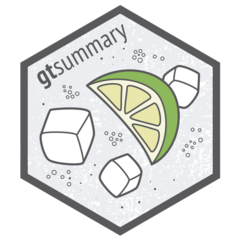

##

:::::::: columns
:::::: {.column width="65%"}
#### How it started

::: small
-   Began to address reproducibility issues while working in academia

-   Goal to build a package to summarize study results with code that was [both simple and customizable]{.emphasis}
:::

:::: fragment
#### How it's going

::: small
-   The stats

    -   [1,700,000 installations]{.emphasis} from CRAN
    -   1,200 GitHub stars
    -   1,000 citations in peer-reviewed articles
    -   50 code contributors

-   Won the 2021 American Statistical Association (ASA) Innovation in Programming Award

-   Won the 2024 Posit Pharma Table Contest

-   Won the 2025 Brian Bole Award of Excellence from R in Pharma
:::
::::
::::::

::: {.column width="35%"}



:::
::::::::

## Monthly {gtsummary} CRAN Downloads

```{r}
#| echo: false
pkgs_all <- 
  c("gtsummary", "stargazer", "arsenal", "rtables",
    "table1", "tableone", "modelsummary",
    "finalfit", "furniture", "compareGroups",
    "tangram", "atable", "texreg", "apsrtable",
    "tables", "qwraps2", "summarytools", "tfrmt", "tidytlg", "Tplyr")
pkgs_pharmaverse <- c("gtsummary", "rtables", "tfrmt", "tidytlg", "Tplyr")

df_30day <- 
  cranlogs::cran_downloads(packages = pkgs_all, from = "2025-08-15", to = "2025-09-15") |> 
  dplyr::summarise(.by = package, count = sum(count)) |> 
  dplyr::arrange(-count) |> 
  dplyr::mutate(
    pharmaverse = package %in% pkgs_pharmaverse
  )

# pharmaverse downloads
df_30day |> 
  dplyr::mutate(
    pharmaverse = ifelse(pharmaverse, "pharmaverse package", "non-pharmaverse package")
  ) |> 
  ggplot(aes(y = count, x = fct_reorder(package, count), color = pharmaverse, fill = pharmaverse)) +
  geom_bar(stat = "identity", linewidth = 0.1) +
  scale_y_continuous(expand = c(0, 0), n.breaks = 20, labels = gtsummary::label_style_number()) +
  scale_x_discrete(label = \(.x) ifelse(.x == "gtsummary", "gtsummary", strrep("x", nchar(.x)))) + 
  coord_flip() +
  labs(x = NULL, y = "30-Day Downloads", color = NULL, fill = NULL) +
  theme_minimal() +
  theme(legend.position = "bottom") +
  ggplot2::theme(axis.text.x = ggplot2::element_text(angle = 20, vjust = 0.8, hjust=0.8)) +
  scale_color_manual(values=c("#DBD6D1", "#007AC2")) +
  scale_fill_manual(values=c("#DBD6D1", "#007AC2")) +
  NULL
```

::: aside
Figure contains 30-day downloads for all summary table packages on CRAN.
:::


## {gtsummary} overview

::: {.columns}
::: {.column width="50%"}
-   Create [tabular summaries]{.emphasis} with sensible defaults but highly customizable
-   Types of summaries:
    -   Demographic- or "Table 1"-types
    -   Cross-tabulation
    -   Regression models
    -   Survival data
    -   Survey data
    -   Custom tables
:::

::: {.column width="50%"}
-   Report statistics from {gtsummary} tables [inline]{.emphasis} in R Markdown
-   Stack and/or merge any table type
-   Use [themes]{.emphasis} to standardize across tables
-   Choose from different [print engines]{.emphasis}
:::
:::


## {gtsummary} overview

For our workshop, we will focus on the following summary types as well as [themes]{.emphasis} and  [print engines]{.emphasis}.

- `tbl_summary()`

- `tbl_hierarchical()`

::: {.fragment}

Other functions helpful functions we're not covering:

::: {.small}

- `tbl_hierarchical_count()`: similar to `tbl_hierarchical()` for counts instead of rates

- `tbl_cross()`: cross tabulations

- `tbl_continuous()`: summarizing continuous variables by 2 categorical variables

- `tbl_wide_summary()`: similar to `tbl_summary()` but statistics are presented in separate columns

- many more!

:::
:::
